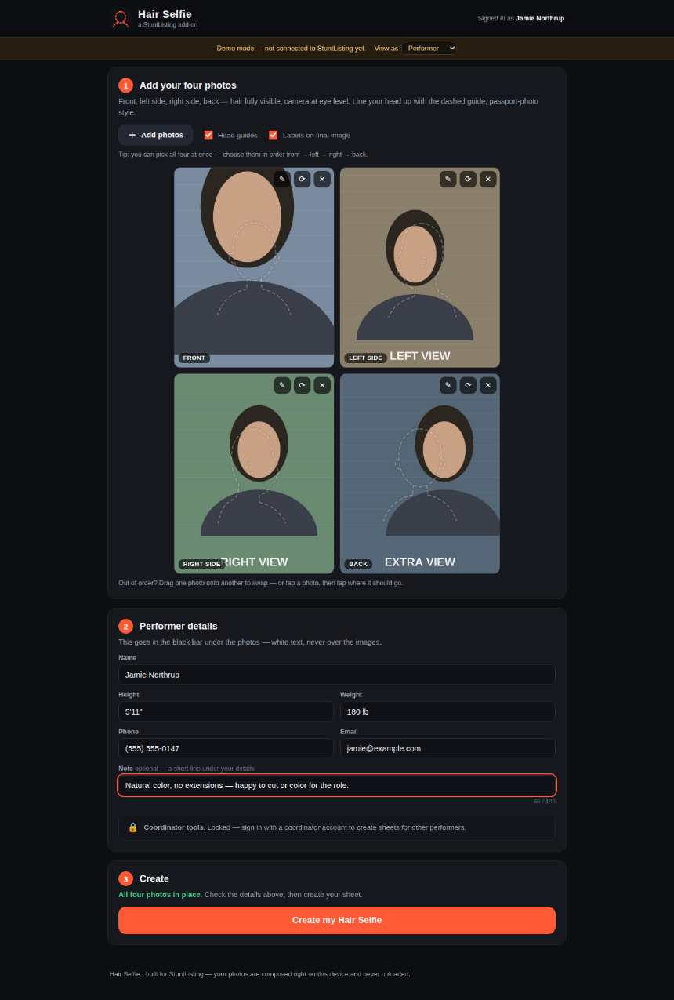
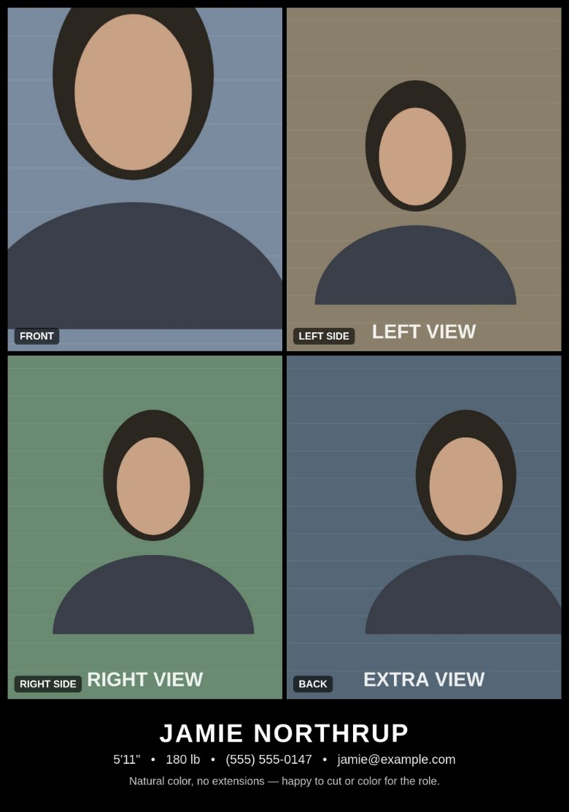

# Hair Selfie · a StuntListing add-on

Build a four-angle **hair reference sheet** — front, left side, right side, back — right from a
phone or computer, with the performer's details printed underneath, and download it as a single
JPEG.



## What it does

- **Four photo positions** (Front · Left side · Right side · Back) laid out in a 2×2 grid.
  Add photos by tapping a position, using the **Add photos** button (pick all four at once),
  or dragging files in from your computer.
- **Drag into position** — drop a file straight onto the spot it belongs in, drag a placed photo
  onto another to swap them (desktop, and iOS long-press drag), or tap one photo then tap where
  it should go (works everywhere).
- **Passport-style head guides** — each position shows a dashed head-and-shoulders outline
  (front or profile, matching the angle) so every photo is framed the same way. A faint version
  of the guide sits over placed photos too, and can be toggled off.
- **Adjust framing** — per-photo zoom, drag-to-reposition, and 90° rotation, with the head guide
  overlaid. What you see in the editor is exactly what's exported.
- **Details bar** — name, height, weight, phone and email printed as white text on the black
  band *below* the photos (never over them). Empty fields are simply left out.
- **Optional note** — a short line (up to 140 characters) under the details, for things like
  "Natural color, no extensions — happy to cut or color". It wraps to a second line if needed,
  sits slightly dimmer than the contact details, and the band grows to fit it. The note belongs
  to the sheet rather than the person, so it stays put when a coordinator switches performers.
- **Coordinator tools** — locked for regular users. Signed in as a coordinator, you get an
  autocomplete performer search; picking a performer swaps their details into the sheet
  (with a one-click "switch back to me"). By default the sheet always uses **your** info.
- **Create & download** — one button renders the sheet (about 2050×2900 px) and offers it as a
  JPEG download. On phones you can also long-press the preview and "Save to Photos".
- **Private by design** — photos are composed entirely in the browser with canvas.
  Nothing is uploaded.



## Running it

It's a static page — no build step. The site lives in `public/`.

```bash
# with Cloudflare's dev server (same behavior as production):
npx wrangler dev

# …or any static server:
python3 -m http.server 8000 -d public
```

Opening `public/index.html` straight from disk works too.

Out of the box it runs in **demo mode**: your profile is kept in this browser's localStorage and
the performer search uses a built-in fictional roster. The banner at the top lets you flip
between *Performer* and *Coordinator* views to try both experiences.

## Deploying to Cloudflare

The repo is set up as a Cloudflare **Workers static-assets** project (`wrangler.jsonc` points at
`public/`, no server code). Two ways to ship it:

**From a terminal** (one-off):

```bash
npx wrangler deploy        # prompts a browser login the first time
```

That publishes to `https://hairselfie.<your-subdomain>.workers.dev`.

**Automatically on every push** — the included GitHub Action
(`.github/workflows/deploy.yml`) deploys whenever the main development branch is pushed.
It needs two repository secrets (GitHub → Settings → Secrets and variables → Actions):

- `CLOUDFLARE_API_TOKEN` — create at dash.cloudflare.com → My Profile → API Tokens with the
  **Edit Cloudflare Workers** template
- `CLOUDFLARE_ACCOUNT_ID` — shown on the Workers overview page of the dashboard

(Alternatively, skip both and connect the repo in the Cloudflare dashboard: Workers & Pages →
Create → import the GitHub repository — Cloudflare then builds and deploys on push by itself.)

## Wiring it into StuntListing

All backend contact goes through two calls in `public/js/api.js`; everything else is UI. To connect the
real site:

1. In `public/js/config.js` set `mode: 'stuntlisting'`.
2. Serve the app from a StuntListing origin (e.g. `stuntlisting.com/hair-selfie/`) so the
   session cookie rides along, and implement the two endpoints:

   **`GET /api/hair-selfie/session`** → who is signed in, and are they a coordinator?

   ```json
   {
     "user": {
       "id": "123",
       "name": "Jamie Northrup",
       "height": "6'0\"",
       "weight": "185 lb",
       "phone": "(555) 555-0100",
       "email": "jamie@example.com"
     },
     "coordinator": false
   }
   ```

   **`GET /api/hair-selfie/performers?q=al`** → autocomplete results (same person shape):

   ```json
   [
     { "id": "88", "name": "Alexis Tran", "height": "5'4\"", "weight": "121 lb",
       "phone": "(310) 555-0141", "email": "alexis@example.com" }
   ]
   ```

3. **Enforce the coordinator check server-side.** The UI hides coordinator tools from
   non-coordinators, but that's cosmetic — the performer-search endpoint returns contact info,
   so it must return `403` unless the session user really is a coordinator.

Endpoint paths are configurable in `public/js/config.js` if you'd rather mount them elsewhere.

## Customizing

Everything below lives in `public/js/config.js` / CSS variables:

- **Output size** — `output.cellWidth` / `output.cellHeight` (default 1000×1250 per photo,
  4:5 portrait).
- **JPEG vs PNG** — `output.format: 'image/png'` switches the export and the downloaded file
  extension; JPEG is the default because files are ~5× smaller and phones handle them everywhere.
- **Look & feel** — colors are CSS variables at the top of `public/css/styles.css`.
- **Position labels** on the final sheet ("FRONT", "LEFT SIDE"…) are a user-facing toggle.

## Files

| File | What it is |
| --- | --- |
| `public/index.html` | The page: photo grid, details form, coordinator box, adjust dialog |
| `public/css/styles.css` | All styling (dark theme) |
| `public/js/config.js` | Mode, endpoint paths, output size/format |
| `public/js/api.js` | Session + performer search adapter (demo and live implementations) |
| `public/js/outlines.js` | The dashed passport-style head guides (front + profile SVG paths) |
| `public/js/composer.js` | Canvas rendering: shared photo-framing math and final-sheet composition |
| `public/js/app.js` | UI wiring: uploads, drag/swap, adjust dialog, autocomplete, create/download |
| `wrangler.jsonc` | Cloudflare Workers static-assets config |
| `.github/workflows/deploy.yml` | Auto-deploy to Cloudflare on push |

## Browser support

Modern evergreen browsers, iOS Safari 14+ and Android Chrome. HEIC photos are supported wherever
the browser can decode them (iPhones hand the picker's photos over as JPEG by default); if a
browser can't read a file, the app says so instead of failing silently.
